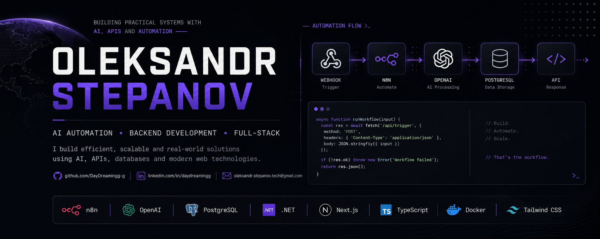

  

  <a href="https://daydreamingg-g.github.io/">Portfolio</a>
  &nbsp;•&nbsp;
  <a href="https://www.linkedin.com/in/daydreamingg/">LinkedIn</a>
  &nbsp;•&nbsp;
  <a href="mailto:oleksandr.stepanov.tech@gmail.com">Email</a>

---

## 👋 About Me

I'm a Computer Science student from Ukraine focused on **AI automation, backend development, and practical software engineering**.

I build systems that connect **AI models, APIs, databases, messaging platforms, and external services** — with a focus on workflows that solve real problems rather than isolated demos.

Currently looking for **Junior / Internship opportunities** in:

- AI Automation
- Workflow Automation
- AI/API Integrations
- Backend Development
- Software Development

---

## 🚀 Featured Projects

### 🤖 AI Customer Support Automation

AI-powered customer support workflow built with **n8n, OpenAI, and PostgreSQL**.

Receives support tickets through an authenticated webhook, validates and stores them, generates AI-powered tags and priority, creates concise summaries, and updates ticket processing state.

**Highlights**
- Authenticated webhook intake
- PostgreSQL persistence
- AI-generated tags
- Dynamic priority classification
- Structured LLM output
- Automated ticket summaries
- Error handling and deterministic workflow logic

**Stack:** `n8n` · `OpenAI` · `PostgreSQL` · `REST API` · `Webhooks` · `Structured Output`

[View Repository →](https://github.com/DayDreamingg-g/AI-Customer-Support-Automation)

---

### 🎯 AI Lead Qualification Automation

AI-powered workflow for automatically evaluating and prioritizing incoming leads.

Scores leads using business criteria, classifies them as **Cold / Warm / Hot**, performs AI analysis, stores processed data in Google Sheets, and sends priority notifications through Telegram.

**Highlights**
- Lead scoring by budget and urgency
- Cold / Warm / Hot classification
- OpenAI analysis
- Google Sheets integration
- OAuth 2.0 authentication
- Telegram priority alerts
- Automated workflow execution

**Stack:** `n8n` · `OpenAI` · `Google Sheets` · `OAuth 2.0` · `Telegram` · `Webhooks`

[View Repository →](https://github.com/DayDreamingg-g/n8n-ai-lead-automation)

---

### ✍️ Telegram AI Script Generator

Telegram AI bot for generating structured short-form video scripts.

Handles Telegram commands, generates scripts using OpenAI, stores generation history, manages invalid input, and automatically delivers responses back to the user.

**Highlights**
- Telegram command routing
- AI-powered script generation
- Persistent generation history
- Fallback handling
- Automated response delivery
- Multi-step n8n workflow

**Stack:** `n8n` · `OpenAI` · `Telegram Bot API` · `Automation`

[View Repository →](https://github.com/DayDreamingg-g/n8n-telegram-ai-script-generator)

---

### 💇 Beauty Booking Platform

Full-stack booking platform for managing services, masters, and customer appointments.

Built as a practical full-stack project with a production frontend, REST API, relational database, and booking workflow.

**Highlights**
- Full booking flow
- REST API
- PostgreSQL database
- Prisma ORM
- Responsive UI
- Production deployment

**Stack:** `Next.js` · `TypeScript` · `PostgreSQL` · `Prisma` · `Tailwind CSS`

[View Repository →](https://github.com/DayDreamingg-g/beauty-booking-site) · [Live Demo →](https://beauty-booking-site.vercel.app/)

---

## 🧩 Other Projects

### 🏦 MiniBank API

Backend banking API built with **ASP.NET Core** and a layered architecture.

Includes accounts, transactions, validation, structured API endpoints, CQRS-style request handling, and database persistence.

**Stack:** `C#` · `ASP.NET Core` · `Entity Framework Core` · `MediatR` · `SQL`

[View Repository →](https://github.com/DayDreamingg-g)

---

### ⏱️ TimeMachine

Desktop productivity tracker built in **C# / .NET**.

Tracks working modes, inactivity, distractions, context switching, and generates productivity reports.

**Stack:** `C#` · `.NET`

[View GitHub Profile →](https://github.com/DayDreamingg-g)

---

### 🔐 CyberLab

Practical cybersecurity learning environment with documented Linux and networking exercises.

Topics include:

- Kali Linux setup
- IP addressing and routing
- DNS
- DHCP
- ARP
- NAT
- Linux networking tools

[View Repository →](https://github.com/DayDreamingg-g)

---

## 🛠️ Tech Stack

### AI & Automation

`n8n` · `OpenAI` · `LLM Workflows` · `Structured Outputs` · `AI Agents` · `Prompt Engineering`

### Backend

`C#` · `ASP.NET Core` · `REST APIs` · `Webhooks` · `Entity Framework Core` · `MediatR`

### Web

`Next.js` · `TypeScript` · `JavaScript` · `HTML` · `CSS` · `Tailwind CSS`

### Data

`PostgreSQL` · `SQLite` · `SQL` · `Prisma`

### Integrations

`Telegram Bot API` · `Google Sheets` · `OAuth 2.0` · `REST APIs` · `JSON`

### Tools

`Git` · `GitHub` · `Docker` · `Linux` · `Vercel` · `VS Code`

---

## 🎯 Current Focus

Currently developing deeper skills in:

- Advanced n8n workflow architecture
- AI agents and tool-based workflows
- Reliable LLM structured outputs
- API integrations and authentication
- Workflow monitoring and error handling
- RAG and vector databases
- Production-ready AI automation

---

## 🎓 Education

**Mykolayiv National Agrarian University**  
Bachelor's Degree Candidate — Computer Science  
2024–2028

Focus areas include software development, databases, AI, data processing, backend systems, and automation.

---

## 📫 Contact

**Portfolio:** https://daydreamingg-g.github.io/  
**GitHub:** https://github.com/DayDreamingg-g  
**LinkedIn:** https://www.linkedin.com/in/daydreamingg/  
**Email:** oleksandr.stepanov.tech@gmail.com

---

  <b>Open to remote Junior / Internship opportunities in AI Automation and Software Development.</b>

